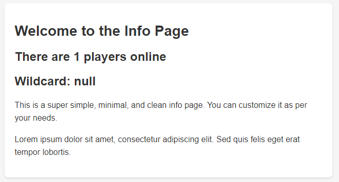
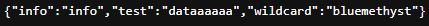
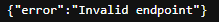

# KubeREST

A way to host a simple API/Webpage on a Minecraft server using KubeJs.







## Dependencies
- [KubeJS](https://www.curseforge.com/minecraft/mc-mods/kubejs)
- [Rhino](https://www.curseforge.com/minecraft/mc-mods/rhino)
- [Architectury API](https://www.curseforge.com/minecraft/mc-mods/architectury-api)
### Recommend but not required
- [ProbeJS](https://www.curseforge.com/minecraft/mc-mods/probejs)

## Example usage:
```javascript
ServerEvents.loaded((serverEvent) => { // when the server loads
    KubeREST.host(8000, (e) => { // host a new webserver on port 8000
        e.onGet("/*", (request) => { // when something connects on any path other then root
            request.respondJson( // respond with some Json data
                {
                    error: "Invalid endpoint",
                },
                404 // and a 404 status code
            );
        });
        e.onGet("/api/stats/*/data", (request) => { // when something connects to /api/stats/*/data where * is a wildcard
            request.respondJson( // respond with some Json data
                {
                    info: "info",
                    test: "dataaaaaa",
                    wildcard: request.wildcard, // the wildcard is stored in request.wildcard
                },
                200 // and a 200 status code because this was a successful request
            );
        });
        e.onGet("/info", (request) => { // when something connects to /info
            request.respondHtml( // respond with some HTML data
                `<!DOCTYPE html> // this is an entire HTML document that will be sent to the client and displayed like a website!
                <html lang="en">
                    <head>
                        <meta charset="UTF-8">
                        <meta name="viewport" content="width=device-width, initial-scale=1.0">
                        <title>Minimal Info Page</title>
                        <style>
                            body {
                                font-family: Arial, sans-serif;
                                margin: 0;
                                padding: 0;
                                background-color: #f5f5f5;
                                color: #333;
                            }

                            .container {
                                max-width: 600px;
                                margin: 20px auto;
                                padding: 20px;
                                background-color: #fff;
                                border-radius: 8px;
                                box-shadow: 0 2px 4px rgba(0, 0, 0, 0.1);
                            }

                            h1 {
                                font-size: 28px;
                                margin-bottom: 20px;
                            }

                            p {
                                font-size: 16px;
                                line-height: 1.6;
                            }
                        </style>
                    </head>
                    <body>
                        <div class="container">
                            <h1>Welcome to the Info Page</h1>
                            <h2>There are ${serverEvent.server.playerCount} players online</h2>
                            <h2>Wildcard: ${request.wildcard}</h2>
                            <p>This is a super simple, minimal, and clean info page. You can customize it as per your needs.</p>
                            <p>Lorem ipsum dolor sit amet, consectetur adipiscing elit. Sed quis felis eget erat tempor lobortis.</p>
                        </div>
                    </body>
                </html>`,
                200 // and dont forget the status code!
            );
        });
    });
});
ServerEvents.unloaded((e) => { // when the server shutsdown
    KubeREST.stop(8000); // stop the webserver hosted on port 8000
});
```

## Credits
[FooterMan15](https://github.com/FooterManDev) - KubeJS mod Addon template

[Bluemethyst](https://bluemethyst.dev) - Uh... being cool idk, once again :P